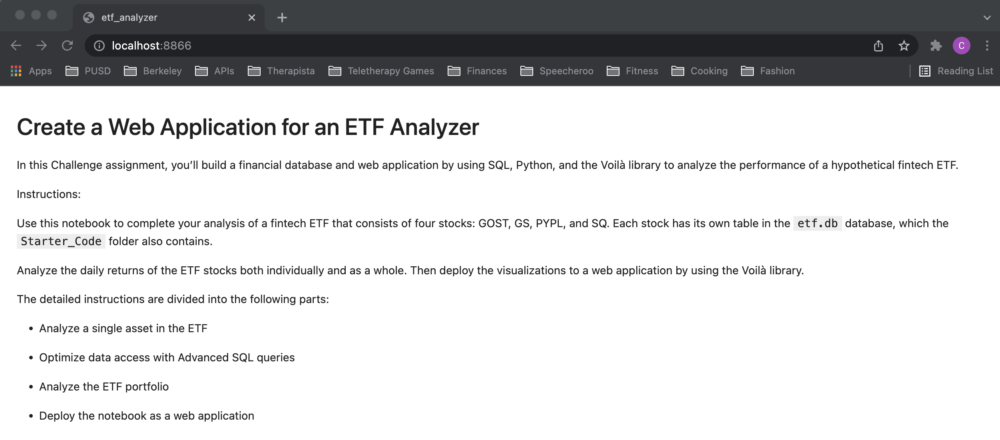
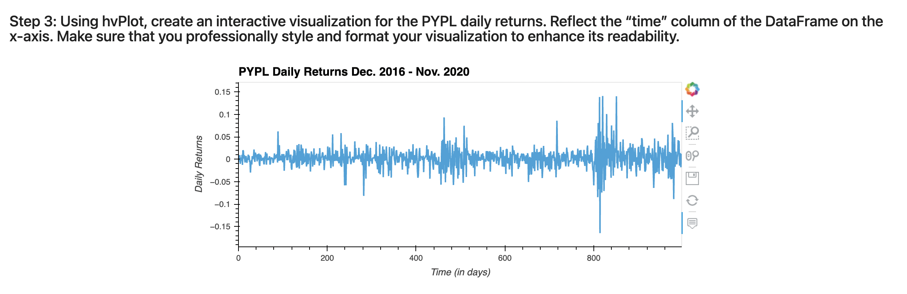
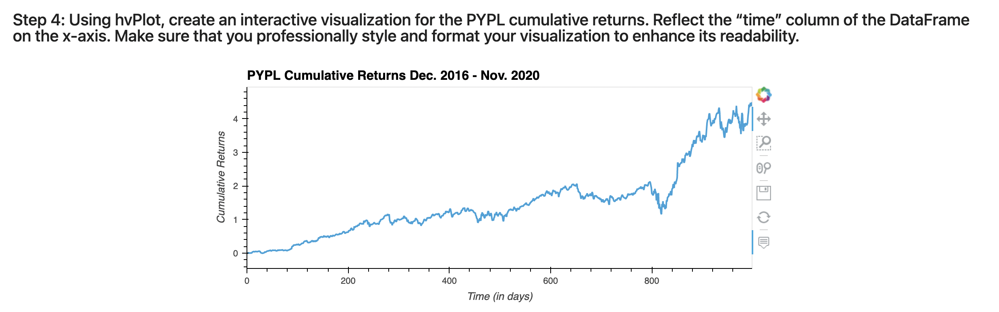
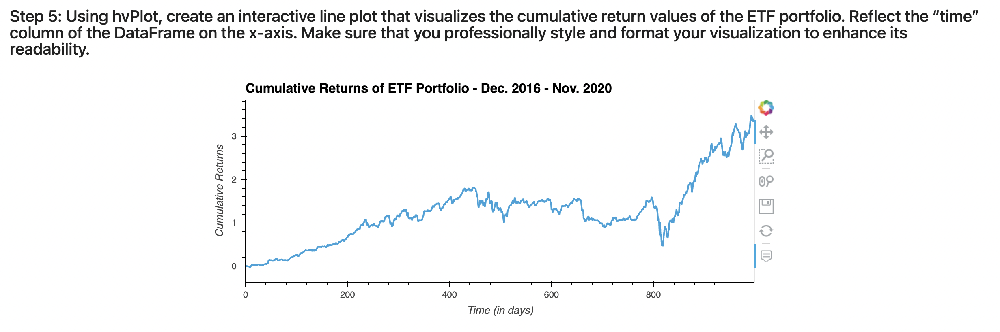

# Analysis of ETF Data Stored in a SQL Database
This analysis uses SQL, Python, and the Voilà library to analyze the performance of a hypothetical fintech ETF. 

---

## Technologies
This project uses Jupyter Notebook (within [JupyterLab](https://jupyterlab.readthedocs.io/en/stable/)) and the standard Python 3.8 libraries. In addition, this project requires the following libraries and/or dependencies:

* [Pandas](https://pandas.pydata.org/) - a software library designed for open source data analysis and manipulation
* [hvplot](https://hvplot.holoviz.org/) - interactive plotting API that supports panning, zooming, hovering, and clickable/selectable legends
* [NumPy](https://numpy.org/) - a Python library that provides a multidimensional array object, various derived objects, and an assortment of routines for fast operations on arrays, including mathematical, logical, shape manipulation, sorting, selecting, I/O, discrete Fourier transforms, basic linear algebra, basic statistical operations, random simulation and much more
* [sqlalchemy](https://www.sqlalchemy.org/) - provides a full suite of well known enterprise-level persistence patterns, designed for efficient and high-performing database access, adapted into a simple and Pythonic domain language

---

## Installation Guide
Before running the application, first install the following dependencies:
```
Install Anaconda Package
Pip install Jupyter
conda install -c pyviz hvplot 
pip install SQLAlchemy
conda install -c conda-forge voila
```

Verify the installations:
```
conda list hvplot
conda list sqlalchemy
conda list voila
```

---

## Usage
To interact with the analysis of the hypothetical fintech ETF:
1. Clone the repository 
`git clone https://github.com/ccroft6/ETF_Analyzer.git`

2. Open terminal at this repository location. Activate the environment and launch jupyter lab:

```
conda activate dev
jupyter lab 
```
*Jupyter lab should launch in a web browser. If it doesn't launch, select one of the hyperlinks that it provides, copy it, and paste it into a web browser.* 

---

## Methods
The following steps were taken for this analysis:
1. Analyze a single asset in the ETF
2. Optimize data access with advanced SQL queries
3. Analyze the ETF portfolio
4. Deploy the notebook as a web application via Voilà

---

## Web Application via Voilà
In order to deploy the jupyter notebook as a web application, I typed the following code into my terminal:

`voila etf_analyzer.ipynb`

**Here is a photo of the web application running in the browser:**



**Here are photos of the graphs shown on the web application:**







---

## Contributors
Catherine Croft

Email: catherinecroft1014@gmail.com

LinkedIn: [catherine-croft](https://www.linkedin.com/in/catherine-croft-4715481aa/)

---

## License 

MIT